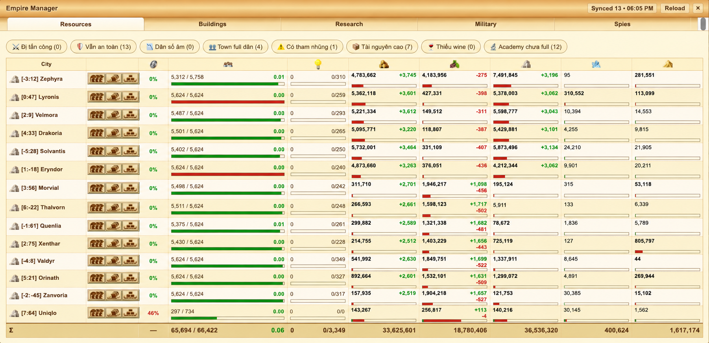
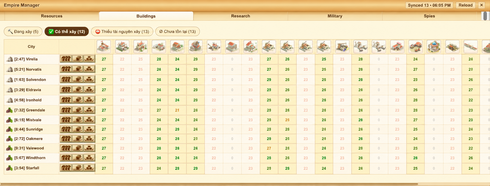

# IkaKit

IkaKit là tiện ích mở rộng trình duyệt dành cho Ikariam, được cộng đồng phát
triển để bổ sung công cụ quản lý đế chế, cảnh báo và các cải thiện trải nghiệm
ngay trong giao diện game, giúp người chơi xem tình hình thành phố nhanh hơn và
giảm các thao tác lặp lại.

IkaKit lấy cảm hứng từ các ý tưởng phía sau IkaEasy v3, nhưng được viết lại từ
đầu với trọng tâm là kiến trúc module, khả năng tương thích đa trình duyệt, khả
năng mở rộng và bảo trì lâu dài.

Extension hỗ trợ Chrome/Chromium và Firefox thông qua WebExtension Manifest V3,
content script, background script và `webextension-polyfill`. Extension đã được
test trên nhiều trình duyệt nền Chromium, gồm Google Chrome, Microsoft Edge,
Brave, Opera, Vivaldi, SRWare Iron và Cốc Cốc (Gang Jing Browser), cũng như
Mozilla Firefox.

## Tài Liệu

- Tài liệu tiếng Anh đầy đủ: [README.md](README.md)
- Tài liệu tiếng Việt đầy đủ: [README.vi.md](README.vi.md)
- Bản tóm tắt cộng đồng: [繁體中文](README.zh-Hant.md),
  [Deutsch](README.de.md), [Français](README.fr.md),
  [Русский](README.ru.md), [Ελληνικά](README.el.md),
  [Polski](README.pl.md), [Español](README.es.md) và
  [Türkçe](README.tr.md)

README tiếng Anh và tiếng Việt được duy trì như hai bản tài liệu đầy đủ. Các
bản dịch ngôn ngữ khác trong tương lai nên là bản tóm tắt ngắn cho cộng đồng,
gồm Installation, Features, FAQ và link về README tiếng Anh để đọc chi tiết.

## Demo

### Empire Manager



### Tổng Quan Công Trình



Ảnh demo đã được chỉnh sửa trước khi công khai: tọa độ, tên town và một vài
thông số trong game đã được thay đổi để không ảnh hưởng tới player đã cho mượn
account phục vụ quá trình làm và test extension này.

Media demo dự kiến bổ sung tiếp:

- GIF demo: `docs/assets/demo.gif`
- Ảnh Alerts: `docs/assets/alerts.png`
- Ảnh City Watcher: `docs/assets/city-watcher.png`

Xem [docs/design/README.md](docs/design/README.md) trước khi thêm ảnh để tránh
lộ tên tài khoản, server hoặc tọa độ.

## Vì Sao Dùng IkaKit

- Xem tài nguyên, công trình, nghiên cứu, quân sự và gián điệp của nhiều thành
  phố trong một Empire Manager ngay trong game.
- Chuyển nhanh giữa thành phố và các luồng thao tác thường dùng.
- Theo dõi trạng thái nâng cấp công trình trực tiếp trên town map.
- Nhận cảnh báo Military và Town News qua UI trong game, badge extension và
  desktop notification.
- Build chung một codebase WebExtension cho Chrome/Chromium và Firefox.
- Giữ phạm vi hiện tại tập trung vào hiển thị thông tin và thao tác do người
  chơi chủ động, không chạy automation nền.

## Cảnh Báo

Source code này được chia sẻ cho cộng đồng sử dụng và tham khảo. Người dùng tự
quyết định cách sử dụng và tự chịu trách nhiệm với mục đích sử dụng của mình.

Tác giả không chịu trách nhiệm cho bất kỳ vấn đề, thiệt hại, xử lý tài khoản
hoặc hậu quả nào phát sinh khi người dùng chỉnh sửa, build, phân phối hoặc sử
dụng source code này cho mục đích riêng.

Luật chơi Ikariam, chính sách của nhà phát hành và các giới hạn liên quan đến
tính năng trả phí có thể thay đổi theo thời gian. Trước khi thêm hoặc sử dụng
các chức năng nâng cao, đặc biệt là những chức năng có thể trùng hoặc cạnh tranh
với tính năng premium/trả phí do nhà phát hành cung cấp, hãy tự kiểm tra luật
hiện tại và cân nhắc kỹ.

## Tính năng

- Empire Manager dạng modal được inject trực tiếp vào giao diện Ikariam.
- Tổng quan Resources theo từng thành phố, gồm tài nguyên, nhà ở, nghiên cứu và
  tham nhũng.
- Tổng quan Buildings gồm cấp công trình, trạng thái nâng cấp, chi phí cấp tiếp
  theo và chênh lệch tài nguyên.
- Tab Research với đồng bộ Research Advisor, tổng quan nhóm nghiên cứu, bảng
  academy/scientist và nút mở Research Advisor/Academy.
- Tổng quan Military theo từng thành phố, gồm lục quân và hải quân.
- Tổng quan Espionage theo từng thành phố, gồm cấp nhà gián điệp, học viện và
  xưởng.
- Bộ quét dữ liệu thành phố và cache cục bộ để hiển thị tổng quan nhanh hơn.
- Nút thao tác nhanh để chuyển tài nguyên, điều quân và điều hạm đội.
- Nút chọn nhanh số lượng tài nguyên trong form vận chuyển.
- Bấm vào tên thành phố trong Empire Manager để chuyển thẳng tới thành phố đó.
- Bộ theo dõi nâng cấp công trình trên town map với vòng tròn cấp công trình,
  tooltip chi phí/chênh lệch và nâng cấp trực tiếp khi thành phố đủ tài nguyên.
- Theo dõi điều hướng SPA để UI tự cập nhật khi Ikariam đổi view.
- Panel Alerts để cấu hình Military Alerts, mức độ nguy hiểm incoming, panel
  cảnh báo trong game, desktop notification, badge count và reminder.
- Town News Notification Alert để phát hiện báo cáo gián điệp/quân sự đã xuất
  hiện trong Town News, kèm nút scan, clear và test notification.
- Tab Events trong Alerts để xem sự kiện Military, Town News và game đang
  active, kèm filter, copy, refresh và clear.
- Metadata extension bằng tiếng Anh và tiếng Việt.

Bản port notification này không bao gồm Automation Center, Route Schedule,
auto-send resource, floating game-event launcher hoặc construction
automation/Auto Builder.

## Roadmap

### v2.2

- Thiết kế và prototype Fleet scheduler.
- Kiểm tra tốt hơn hành vi reset badge Alerts.
- Bổ sung thêm GIF demo và ảnh chụp vào README.

### v2.3

- Cải thiện hướng dẫn chẩn đoán quyền notification.
- Làm mượt filter và export trong Events.
- Cải thiện empty state khi thiếu dữ liệu thành phố.

### v2.4

- Khảo sát Plugin API cho module tùy chọn.
- Viết module contract cho contributor.
- Thiết kế extension point an toàn hơn cho tính năng tương lai.

Chi tiết định hướng nằm trong [docs/design/README.md](docs/design/README.md).

## Issue Gợi Ý

Nếu GitHub issue list còn trống, nên tạo trước vài task dễ tiếp cận để repo nhìn
đang được chăm sóc và contributor biết có thể bắt đầu từ đâu:

- `good first issue`: Chụp và thêm ảnh/GIF demo cho README.
- `good first issue`: Thêm empty-state copy cho bảng Empire Manager.
- `enhancement`: Cải thiện chẩn đoán quyền notification.
- `enhancement`: Viết thiết kế Fleet scheduler cho v2.2.
- `bug`: Kiểm tra badge Alerts có reset đúng sau khi clear toàn bộ event không.

## Yêu cầu

- Node.js
- npm

## Cài Đặt Từ Source

Clone repository, cài dependencies, rồi build extension:

```bash
git clone <repo-url>
cd IkaKit
npm install
npm run build
```

Sau khi build xong, output nằm tại:

```text
dist/chrome/
dist/firefox/
```

Load extension vào trình duyệt từ thư mục build tương ứng.

### Chrome / Chromium

1. Mở `chrome://extensions`.
2. Bật `Developer mode`.
3. Chọn `Load unpacked`.
4. Chọn thư mục `dist/chrome`.

### Firefox

1. Mở `about:debugging#/runtime/this-firefox`.
2. Chọn `Load Temporary Add-on`.
3. Chọn file `dist/firefox/manifest.json`.

## Lệnh Build

Build cho Chrome/Chromium:

```bash
npm run build:chrome
```

Build cho Firefox:

```bash
npm run build:firefox
```

Build cả hai bản:

```bash
npm run build
```

## Cấu Trúc Dự Án

```text
src/
  manifests/          Manifest riêng cho từng browser
  background/         Background script
  content/            Content scripts inject vào Ikariam
    helpers/          Storage, navigation và game data bridge
    modules/
      alerts/         Panel Alerts độc lập kèm tab Events
      cityWatcher/    Vòng tròn theo dõi/nâng cấp công trình trên town map
      empire/         Empire Manager và các tab tổng quan
      militaryAlerts/ Cảnh báo sự kiện quân sự incoming
      notificationAlerts/ Cảnh báo Town News gián điệp/quân sự
      transport/      Quick controls cho form vận chuyển
  css/                Style inject vào game
  assets/             Icon và hình ảnh UI
  _locales/           Metadata tiếng Anh và tiếng Việt

scripts/
  build.js            Script build theo browser

dist/
  chrome/             Output build cho Chrome/Chromium
  firefox/            Output build cho Firefox
```

## Cách Hoạt Động

IkaKit chạy trên các trang Ikariam khớp với:

```text
*.ikariam.gameforge.com
```

`content/loader.js` load module chính từ `content/init.js`. Entry point này
khởi động Empire Manager, Alerts panel, transport helpers, Military Alerts,
Notification Alert, navigation watcher và game data layer.

Game data layer inject bridge script vào page context, đọc dữ liệu Ikariam có
sẵn, quét Research Advisor khi được yêu cầu, merge với cache chi tiết thành phố,
rồi thông báo cho UI khi cần refresh tổng quan.

Desktop notification được gửi qua background script của extension. Nếu alert đã
được phát hiện nhưng không thấy notification hệ thống, hãy kiểm tra quyền
notification của trình duyệt và hệ điều hành cho extension.

Tab Alerts Events dùng store active event trong bộ nhớ. Tab này hiển thị sự
kiện được phát hiện trong phiên content script hiện tại và không lưu trạng thái
automation.

## Tài Liệu Thiết Kế

- [Design documentation](docs/design/README.md)
- [Notification port audit](docs/design/notification-port-audit.md)
- [Research and Events port boundary](docs/design/research-events-port-audit.md)

## License

IkaKit sử dụng giấy phép GPL-3.0. Xem [LICENSE](LICENSE).

## Credit

Được truyền cảm hứng từ IkaEasy của vltansky.
